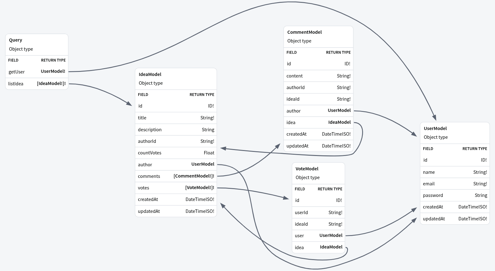
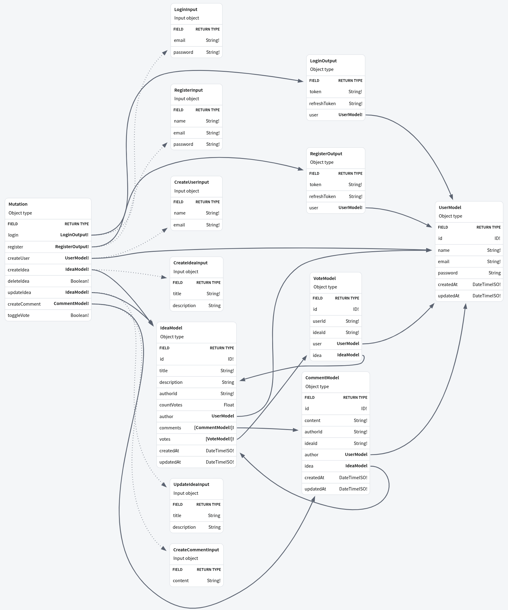

# GraphQL Api

## Resumo
API de sugestão de ideias usando GraphQL, SQLite, Express e Apollo Server. Consiste em:

+ Usuários.
+ Ideias.
+ Comentários.
+ Votos.

Um usuário autenticado pode:
1. criar ideias.
2. apagar ou alterar suas ideias.
3. ver as ideias.
4. votar em ideias.
5. apagar seu voto em alguma ideia.
6. fazer comentários nas ideias.

## Tecnologias Utilizadas 
1. Prisma
2. GraphQL
3. Apollo Sever
4. Express
5. Jsonwebtoken
6. SQLite

## Rodar a API
```bash
npm i
npm run dev
```

## Modelagem
### Operações de leitura


### Operações de escrita
